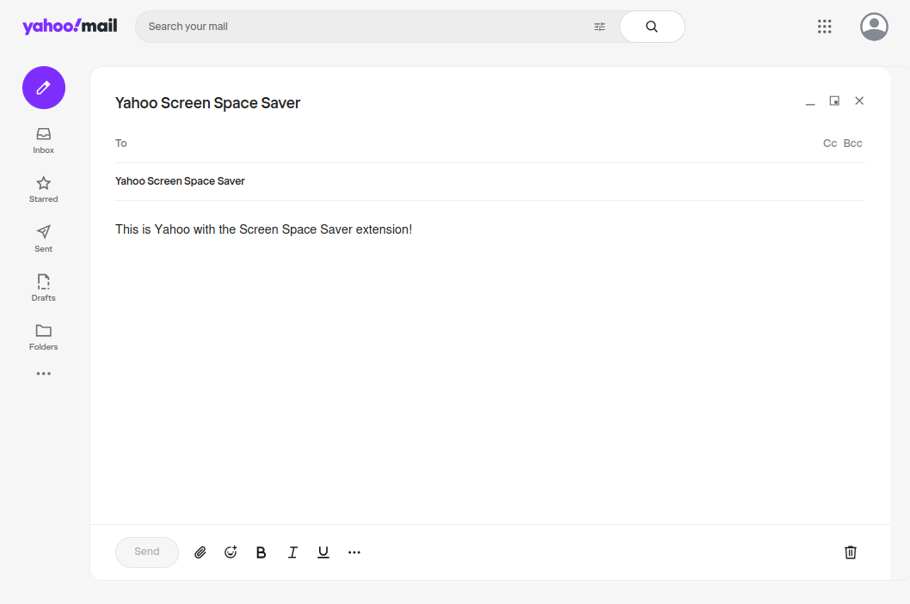

# Yahoo Screen Space Saver

_A Firefox plugin to optimize Yahoo Mail's layout for smaller screens!_

Available on the [Mozilla Add-ons](https://addons.mozilla.org/en-US/firefox/addon/yahoo-screen-space-saver/) page.

For ad blocking, I recommend using the [uBlock Origin](https://addons.mozilla.org/en-US/firefox/addon/ublock-origin/) extension.

## Technical Details

The add-on asks for permission to `Access your data for sites in the mail.yahoo.com domain` and `Access your data for mail.yahoo.com`, but this add-on does not read any of your emails. The permission is required in order to run on yahoo.com.

The source code for this add-on can be found on [GitHub](https://github.com/lgsoohoo/yahooScreenSpaceSaver).

You can also view the code by right-clicking the "Add to Firefox" button and selecting "Save Link As...". Then change the file's extension from `.xpi` to `.zip` and extract the file. 